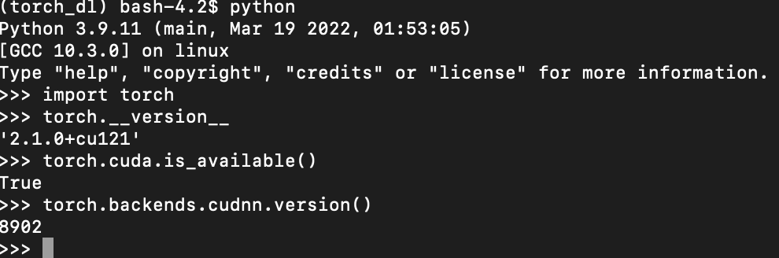

# Use the DTU hpc center 

- log in
```ssh user_name@login1.gbar.dtu.dk```

- go to interactive node
  - ```linuxsh``` node without gpu
  - ```sxm2sh``` node with gpu
  - ```nvidia-smi``` check the existing gpus
 
- In the interactive node, create virtual env (only run the code below once!)
  ```
  module load python3/3.9.11
  python3 -m venv torch_dl
  source torch_dl/bin/activate
  python -m pip install torch torchvision
  python -m pip uninstall urllib3  
  python -m pip install 'urllib3<2.0'
  ```
- Load the necessary packages, e.g.,
  ```
  module load numpy/1.22.3-python-3.9.11-openblas-0.3.19
  module load scipy/1.7.3-python-3.9.11
  ```
- After this, check if you can get the output below:
  
- Run the cifar10 experiment (this is just an example, you need to change some hyperparameters, i.e., number of rounds, number of clients, gpu index
  ```
  ./run_cifar.sh
  ```
  - If you get segmentation fault in an interactive node, check if you are using the correct GPU, i.e., do nvidia-smi, see which gpu is available, assign export CUDA_VISIBLE_DEVICES=?
  - If you submit a job script and only require a single gpu, then the gpu index should be 0.
 
- If you want to submit the job, do
  ```bsub < submit_job.sh```


